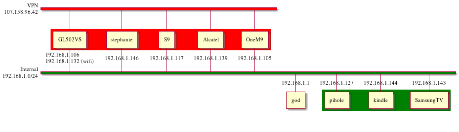

# infra

Infrastructure setup for home network.



## Devices

* [Router](router/README.md)
* [Pi-hole](pihole/README.md)

## Git Setup

To regenerate images/encrypt nvram backups, do the following.

```
$ mv .git/hooks/pre-commit.sample .git/hooks/pre-commit
$ echo -e "\nexec ./scripts/pre-commit" >> .git/hooks/pre-commit
```
