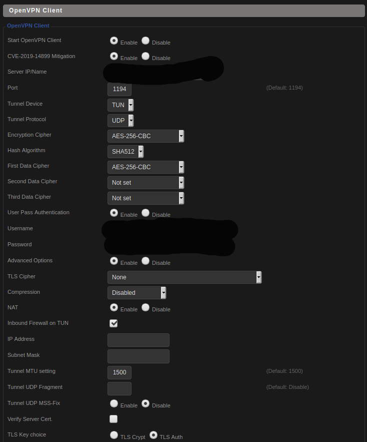

# Router

## Scripts

### [flash-firmware.sh](scripts/flash-firmware.sh)

This script is the cradle for all scripts within this folder.

1. Pull down the latest DD-WRT release from FTP (`download-latest.py`)
2. SCP the downloaded binary and the remote script [router-flash-firmware.sh](router-flash-firmware.sh) to `/tmp/` on the router.
3. SSH into the router and execute the remote script.

### [download-latest.py](scripts/download-latest.py)

Crawls FTP and downloads the latest firmware binary.

### [router-flash-firmware.sh](scripts/router-flash-firmware.sh)

This is the remote execution script for actually flashing the image on the router.

1. Flash binary
2. Reboot

## Setup

### Basic Setup

Set hostname/domain and Timezone

### Static IPs

`Services->Services`

Assign static IPs for VPN devices and Pi-hole.

### Administration

Set `Web Access->Protocol` to HTTPS , `Info Site Password Protection` to Enabled, `Router GUI Style` to Dark, `Display New Features` to Disabled.

### SSH/Keys

In `Services->Services->Secure Shell` enable SSHD and disable password authentication. Add your password protected public RSA key (setup fails with ed25519 keys as of writing this).

`ssh-keygen`

For easy re-entry create the following in `~/.ssh/config`

```
Host router
	User root
	HostName 192.168.1.1
	Port 2222
	IdentityFile ~/.ssh/god_ed25519
```

### IPV6

Not even once...

Path | Field | Value
--- | --- | ---
Setup->IPV6 | IPv6 | Disable

### Wireless

1. Rename wireless networks
2. `Wireless Security`: Change passwords under Wireless Security tab
3. `MAC Filter`: Enable MAC filter to permit only listed clients and add them.

### UPnP

Path | Field | Value
--- | --- | ---
NAT/QoS->UPnP | UPnP Service | Disable

### VPN

Determine the fastest server for your VPN, or choose specified location



And add the TLS Key/CA Cert

In the `Advanced Options` section add the following

```
auth-nocache
remote-cert-tls server
remote-random
nobind
tun-mtu 1500
tun-mtu-extra 32
mssfix 1450
persist-key
persist-tun
ping-timer-rem
reneg-sec 0
#log /tmp/vpn.log
#Delete `#` in the line below if your router does not have credentials fields and you followed the 3.1 step
#auth-user-pass /tmp/openvpncl/user.conf
```

Under `Administration->Commands` add the following to `Startup`

```
# Fix warning in OpenVPN logs about credentials being group-writeable
chmod 600 /tmp/openvpncl/credentials
```

And add the following to `Firewall`

```
# OpenVPN client policy-based routing killswitch for dropped VPN connection
# to disallow traffic without VPN.

# <hostname here>
iptables -I FORWARD -s <static ip here> -o $(nvram get wan_iface) -j DROP

```

#### Killswitch for dropped VPN connection

Add the following to commands, replacing each IP with the IPs you used in policy-based routing in OpenVPN's config and click `Save Firewall`.

```
# OpenVPN client policy-based routing killswitch for dropped VPN connection
# to disallow traffic without VPN.
iptables -I FORWARD -s <ip here> -o $(nvram get wan_iface) -j DROP
# add other devices here or use range
```

## Pi-hole (optional)

Path | Field | Value
--- | --- | ---
Services->Services->Dnsmasq | Additional Dnsmasq Options | dhcp-option=6,*\<pi ip here\>*
